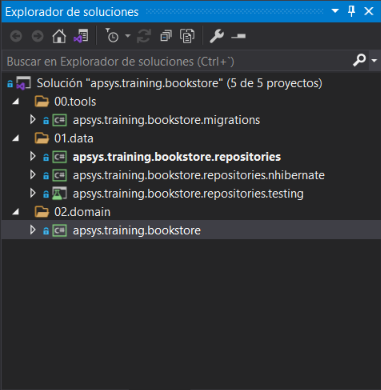
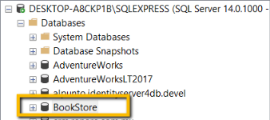

# Documentación de capa de datos


## Estructura inicial del proyecto


## Definición del dominio


```c#
public class Book
{
    public string Id { get; set; }
    public string Title { get; set; }
    public string ISBN { get; set; }
    public string Genre { get; set; }
    public DateTime PublishDate { get; set; }
    public Author Author { get; set; }
}
```


```c#
public class Author
{
    public string Id { get; set; }
    public string FirstName { get; set; }
    public string LastName { get; set; }
    public IEnumerable<Book> Books { get; set; }
}
```

## Crear la estructura de la base de datos

### Base de datos



### Migraciones

```
Install-Package FluentMigrator -Version 3.3.1
Install-Package FluentMigrator.Extensions.SqlServer -Version 3.3.1
Install-Package FluentMigrator.Runner -Version 3.3.1
```

### Add Authors table

```c#
[Migration(1)]
public class M01_CreateAuthorsTable: Migration
{
    public override void Up()
    {
        Create.Table("Authors")
            .WithColumn("Id").AsString().PrimaryKey()
            .WithColumn("FirstName").AsString().NotNullable()
            .WithColumn("LastName").AsString().NotNullable();
    }

    public override void Down()
    {
        Delete.Table("Authors");
    }
}
```

### Running migrations

```c#
public class Program
{
    static int Main()
    {
        try
        {
            CommandLineArgs parameter = new CommandLineArgs();
            if (!parameter.ContainsKey("cnn"))
                throw new ArgumentException("No [cnn] parameter received. You need pass the connection string in order to execute the migrations");
            
            string connectionString = parameter["cnn"];
            var serviceProvider = CreateServices(connectionString);
            using var scope = serviceProvider.CreateScope();
            UpdateDatabase(scope.ServiceProvider);
            return (int)ExitCode.Success;
        }
        catch (Exception ex)
        {
            Console.ForegroundColor = ConsoleColor.Red;
            Console.WriteLine($"Error updating the database schema: {ex.Message}");
            Console.ResetColor();
            return (int)ExitCode.UnknownError;
        }
    }

    private static IServiceProvider CreateServices(string connectionString)
    {
        return new ServiceCollection()
            .AddFluentMigratorCore()
            .ConfigureRunner(rb => rb
                .AddSqlServer2016()
                .WithGlobalConnectionString(connectionString)
                .ScanIn(typeof(M01_CreateAuthorsTable).Assembly).For.Migrations())
            .AddLogging(lb => lb.AddFluentMigratorConsole())
            .BuildServiceProvider(false);
    }

    private static void UpdateDatabase(IServiceProvider serviceProvider)
    {
        var runner = serviceProvider.GetRequiredService<IMigrationRunner>();
        runner.MigrateUp();
    }

}
    
enum ExitCode
{
    Success = 0,
    UnknownError = 1
}
    
class CommandLineArgs : Dictionary<string, string>
{
    private const string Pattern = @"\/(?<argname>\w+):(?<argvalue>.+)";
    private readonly Regex _regex = new Regex(Pattern, RegexOptions.IgnoreCase | RegexOptions.Compiled);

    public CommandLineArgs()
    {
        var args = Environment.GetCommandLineArgs();
        foreach (var match in args.Select(arg => _regex.Match(arg)).Where(m => m.Success))
            this.Add(match.Groups["argname"].Value, match.Groups["argvalue"].Value);
    }
}
```

## Unit of Work

```
Install-Package apsys.repository.core
```

```c#
public interface IUnitOfWork
{
    void Commit();
    void Rollback();
}
```

```c#
public interface IAuthorsRepository: IRepository<Author>
{
}
```

```c#
public interface IUnitOfWork
{
    IAuthorsRepository Authors { get; }
    void Commit();
    void Rollback();
}
```

## Implementing Unit of Work with NHibernate

```
Install-Package apsys.repository.core
Install-Package apsys.repository.nhibernate.core
Install-Package NHibernate
Install-Package FluentNHibernate
```

```c#
public class UnitOfWork: IUnitOfWork
{
    private readonly ISession _session;
    private ITransaction _transaction;

    public UnitOfWork(ISession session)
    {
        _session = session;
        this._transaction = session.BeginTransaction();
    }
    
    public IAuthorsRepository Authors { get; }
    
    public void Commit()
    {
        if (this._transaction != null && this._transaction.IsActive)
            this._transaction.Commit();
        else
            throw new TransactionException("The actual transaction is not longer active");
    }

    public void Rollback()
    {
        if (this._transaction != null && this._transaction.IsActive)
            this._transaction.Rollback();
        else
            throw new TransactionException("The actual transaction is not longer active");
    }
}
```

```c#
public class AuthorsRepository: Repository<Author>,  IAuthorsRepository 
{
    public AuthorsRepository(ISession session) 
        : base(session)
    {
    }
}
```


```c#
public class UnitOfWork: IUnitOfWork
{    
    ...

    public UnitOfWork(ISession session)
    {
        _session = session;
        this._transaction = session.BeginTransaction();
        this.Authors = new AuthorsRepository(this._session);
    }    
    ...
}
```

```c#
public class AuthorsMappers: ClassMapping<Author>
{

    public AuthorsMappers()
    {
        Table("ApplicationRoles");
        Id(x => x.Id, x =>
        {
            x.Generator(Generators.Assigned);
            x.Column("Id");
        });
        Property(x => x.FirstName, x =>
        {
            x.Column("FirstName");
        });            
        Property(x => x.LastName, x =>
        {
            x.Column("LastName");
        });
    }
}
```