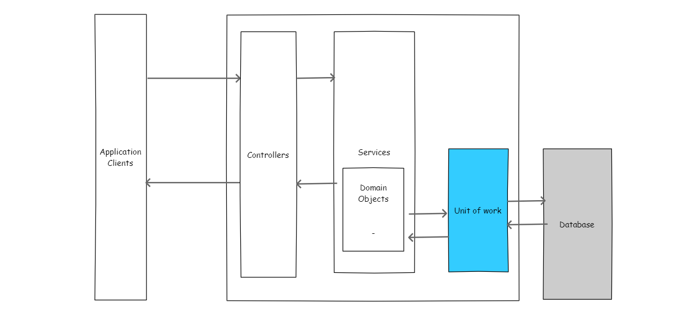

# Introducción
El presente material establece una guía sobre como inicializar, configurar, verificar e implementar una capa de acceso a datos para los proyectos `backend` de APSYS. Para ejemplificar de manera práctica, se desarrollará el código requerido para un proyecto llamado `bookstore`

## Arquitectura de un backend
Las aplicaciones de backend desarrolladas generalmente siguen un organización de capas como la que se muestra en la imagen a continuación



Esta guía explica como realizar la implementación usando los patrones de diseño `unitOfWork` y `repository`. Para mayor documentación sobre estos patrones de diseño, puedes consultar las referencias: 

<a href="https://martinfowler.com/eaaCatalog/unitOfWork.html">https://martinfowler.com/eaaCatalog/unitOfWork.html</a>
<a href="https://martinfowler.com/eaaCatalog/repository.html">https://martinfowler.com/eaaCatalog/repository.html</a>

## Inicialización de un proyecto

Crea una solución en blanco usando Visual Studio 2017 o 2019, con el nombre `apsys.training.bookstore.sln`. Dentro de esa solución agrega los siguientes proyecto, organizados como se muestra a continuación

| Proyecto                                         | Tipo de proyecto      | Carpeta   |
| -----                                            | ------                | -----     |
| apsys.training.bookstore                         | Biblioteca de clases  | 02.domain |
| apsys.training.bookstore.repositories            | Biblioteca de clases  | 01.data   |
| apsys.training.bookstore.repositories.nhibernate | Biblioteca de clases  | 01.data   |
| apsys.training.bookstore.repositories.nhibernate | Biblioteca de clases  | 01.data   |
| apsys.training.bookstore.repositories.testing    | NUnit                 | 01.data   |
| apsys.training.bookstore.migrations              | Aplicación de consola | 00.tools  |


## Definición del dominio
La capa de datos se encarga de persistir y recuperar nuestras entidades del dominio de una base de datos, por lo que necesitamos de primera instancia entidades en nuestro dominio. 

Agrega las siguientes clases a el proyecto `apsys.training.bookstore`

```c#
public class Author
{
    public string Id { get; set; }
    public string FirstName { get; set; }
    public string LastName { get; set; }
    public IEnumerable<Book> Books { get; set; }
}
```

```c#
public class Book
{
    public string Id { get; set; }
    public string Title { get; set; }
    public string ISBN { get; set; }
    public string Genre { get; set; }
    public DateTime PublishDate { get; set; }
    public Author Author { get; set; }
}
```

